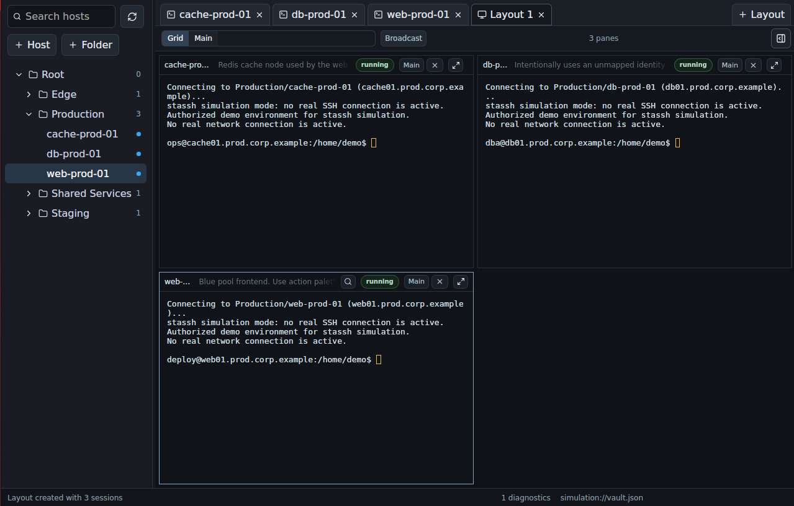

# stassh-rust

`stassh-rust` is a Rust implementation of a portable, offline-first SSH workspace with reusable actions for workflows such as VNC over SSH.

The current codebase provides a `stassh` CLI, a `stassh-tui` terminal UI, a `stassh-gui` desktop app, and a reusable `stassh-core` crate. It stores host inventory and common actions in a local JSON vault, maps machine-local identities and tool capabilities in a local config file, and launches the system OpenSSH client.

`stassh-tui` gives the vault a fast terminal interface for browsing folders,
searching hosts, inspecting jump chains, forwards, and actions, and launching
OpenSSH connections without giving up plain-file portability.


`stassh-gui` presents the same workspace as a desktop app with a persistent host
tree, contextual inspector/editor panes, embedded terminal tabs, terminal layout
tabs, action previews and terminal-session runners, and simulation mode for
screenshot-safe demos.



The longer-term project direction is documented in `docs/BLUEPRINT.md` and `docs/plan/`.

All three frontends share the same core model. Use the CLI for scripting, the
TUI for terminal-first and low-resource workflows, and the GUI when a desktop
workspace with embedded sessions and visual layouts is useful.

## Current Status

Implemented now:

- Cargo workspace with `stassh-core`, `stassh`, `stassh-tui`, and
  `stassh-gui`
- plain, unencrypted `vault.json` storage with `format_version`
- duplicate host detection for vault hygiene
- read-only vault health checks
- folders and hosts with stable UUIDs
- host search and resolution by UUID, exact path/name, or search query
- host add/edit/delete
- folder list/add/rename/move/delete
- jump host chains
- local, remote, and dynamic forwards
- reusable common actions, including SSH-forwarded local tool workflows
- OpenSSH command and config generation
- `stassh connect` using the system `ssh`
- `stassh action` for running and diagnosing reusable actions
- optional encrypted `secrets.json` storage for host-associated fallback secrets
- host-to-secrets-set references with shared sets across multiple hosts
- `stassh secrets manage` for interactive secrets-store administration
- temporary OpenSSH config execution for jumps, forwards, and SSH options
- import of a useful subset of existing OpenSSH config files, including nested `Include` files
- export to OpenSSH config format
- machine-local identity fingerprint to key-path mappings
- fingerprint derivation from provided private key paths with `ssh-keygen -lf`
- basic diagnostics
- optional structured JSON output for CLI commands
- `stassh-tui` for browsing, searching, inspecting, connecting, running actions, and basic vault editing
- optional `stassh-tui` tmux/byobu window launch with `t` for multiple simultaneous SSH sessions
- shared simulation mode for `stassh-tui` and `stassh-gui` with in-memory demo
  vault/local/secrets data, fake encrypted secrets, and scripted terminal
  sessions
- `stassh-gui` with a Tauri desktop shell, host tree, search, contextual
  inspector/editor panel, embedded xterm.js terminal tabs, GUI-managed PTYs,
  and OpenSSH-backed connections
- GUI inspector panes for linked secrets, ordered jump-chain editing, and
  structured local/remote/dynamic forward editing
- GUI action list, resolved dry-run preview, and action terminal-session running
- GUI terminal layout tabs with equal-grid and main-pane modes, drag/drop
  terminal-to-layout composition, layout-local broadcast input, internal
  full-screen terminal panes, per-terminal find, and host-tree open-session
  indicators, plus visible exited-state badges for completed terminal sessions
- GUI simulation mode for screenshot and visual-check workflows

Not implemented yet:

- encrypted vaults
- synchronization journals
- automatic identity discovery by scanning `~/.ssh` or `ssh-agent`
- action authoring helpers that preserve JSON-first workflow definitions

## Build And Test

Requirements:

- Rust/Cargo
- OpenSSH client available as `ssh` for actual connections
- OpenSSH `ssh-keygen` available for identity fingerprint derivation and OpenSSH config import with `IdentityFile`

Build:

```bash
cargo build --workspace
```

Run tests:

```bash
cargo test --workspace
```

Run the CLI from source:

```bash
cargo run -p stassh -- --help
cargo run -p stassh -- --version
```

Run the TUI from source:

```bash
cargo run -p stassh-tui -- --version
cargo run -p stassh-tui
cargo run -p stassh-tui -- --simulation
```

Run the GUI from source:

```bash
cd apps/stassh-gui
npm install
npm run tauri dev
```

Launch the GUI with deterministic demo data and simulated SSH sessions for
screenshots or visual checks:

```bash
cd apps/stassh-gui
npm run tauri dev -- -- --simulation
```

Simulation mode is available in both `stassh-tui` and `stassh-gui`. It keeps the
demo vault, local config, and secrets store in memory. It does not read or write
your real `~/.ssh/stassh` files, and terminal sessions use a small scripted shell
instead of real OpenSSH. Simulated shells print a demo connection message and
prompt automatically, then support simple commands such as `help`, `ls`, `pwd`,
`cat`, `uptime`, `clear`, and `exit`. Fake encrypted demo secrets unlock with
the simulation-only master password `simulation`.

From the repository root, the helper scripts can launch development builds and
optionally use copied demo data or simulation mode:

```bash
./run-stassh-tui-dev.sh
./run-stassh-tui-dev.sh --fixture
./run-stassh-tui-dev.sh --simulation

./run-stassh-gui-dev.sh
./run-stassh-gui-dev.sh --fixture
./run-stassh-gui-dev.sh --simulation
```

## Output Formats

By default, commands print human-readable text.

Use the global output flag for structured JSON:

```bash
stassh --output json vault status
stassh --output json list
stassh --output json diagnose web
```

JSON mode emits one JSON document per command. It is intended for scripts, tests, and future UI integrations.

For `export openssh -`, text mode writes raw OpenSSH config to stdout. JSON mode wraps the exported config in a JSON object:

```bash
stassh export openssh -
stassh --output json export openssh -
```

## Configuration Locations

`stassh` uses two configuration files:

- `vault.json`: portable host, folder, jump, forwarding, action, tag, note, and identity fingerprint records
- local config: machine-local identity fingerprint to private-key path mappings and capability names to executable paths
- `secrets.json`: optional encrypted host-associated secrets sets for fallback operational reference

The local config does not contain private key material, but it can reveal local
usernames and filesystem paths, so it should still be treated as private.
`secrets.json` encrypts fields that are explicitly stored as secrets, but set
names, field names, labels, and plaintext metadata fields remain visible.

By default, new setups use:

```text
~/.ssh/stassh/vault.json
~/.ssh/stassh/local.json
~/.ssh/stassh/secrets.json
```

This makes syncing a personal SSH workspace between machines as simple as copying
`~/.ssh/stassh/`. Existing project-local vaults remain supported.

On Unix-like systems, `stassh` and `stassh-tui` require safe permissions for the
default home configuration directory:

```text
~/.ssh/stassh/            700
~/.ssh/stassh/vault.json  600
~/.ssh/stassh/local.json  600
~/.ssh/stassh/secrets.json  600
```

These checks apply only to paths under `~/.ssh/stassh/`. Project-local and
portable vaults outside that directory are not permission-gated. New files written
by `stassh` are saved with `600` permissions on Unix-like systems.

Vault path resolution order:

1. `--vault /path/to/vault.json`
2. `STASSH_VAULT=/path/to/vault.json`
3. `~/.ssh/stassh/vault.json` when it exists
4. `./vault.json` when it exists
5. `~/.ssh/stassh/vault.json` for a new default path

Local config path resolution order:

1. `--local-config /path/to/local.json`
2. `STASSH_LOCAL_CONFIG=/path/to/local.json`
3. `~/.ssh/stassh/local.json` when the selected vault is `~/.ssh/stassh/vault.json`
4. `.stassh-local.json` beside an explicit non-home vault for portable/project-local use

Choose explicit paths with:

```bash
cargo run -p stassh -- --vault /path/to/vault.json --local-config /path/to/local.json --secrets-file /path/to/secrets.json vault status
```

Or set environment variables:

```bash
export STASSH_VAULT=/path/to/vault.json
export STASSH_LOCAL_CONFIG=/path/to/local.json
export STASSH_SECRETS=/path/to/secrets.json
```

Local `vault.json` files are ignored by Git because vaults may contain infrastructure details.

Older project-local machine mappings are still read from:

```text
.stassh-local.json
```

That file is also ignored by Git.

Secrets path resolution order:

1. `--secrets-file /path/to/secrets.json`
2. `STASSH_SECRETS=/path/to/secrets.json`
3. `~/.ssh/stassh/secrets.json` when the selected vault is `~/.ssh/stassh/vault.json`
4. `secrets.json` beside the selected vault

Manage the optional secrets store with:

```bash
stassh secrets manage
```

Link a host to a reusable secrets set with:

```bash
stassh host edit web --secrets customer-site
stassh host edit web --clear-secrets
```

## Terminal UI

`stassh-tui` is a terminal interface over the same vault used by the CLI. It is
currently focused on fast browsing, searching, inspection, connection launching,
and vault editing for folders, hosts, identities, jump chains, and forwards. The
TUI can select or clear a host's identity fingerprint from the local identity
mappings. Creating, renaming, editing, and removing local identity mappings still
happens through the CLI, as does editing raw SSH options.

Launch it with the same configuration selection behavior as `stassh`:

```bash
stassh-tui --vault /path/to/vault.json --local-config /path/to/local.json
```

Or from source:

```bash
cargo run -p stassh-tui -- --vault /path/to/vault.json --local-config /path/to/local.json
```

If explicit flags are omitted, `stassh-tui` uses the same environment variables
and defaults documented above. Its status line shows both the resolved vault path
and the resolved local config path.

Current keys:

- `j` / `Down`: move selection down
- `k` / `Up`: move selection up
- `/`: enter host search
- `Esc`: leave search mode, or clear a status message in browse mode
- `Backspace`: delete a search character
- `Home`: in browse mode, move to the first visible sibling; in search mode, move to the first result
- `End`: in browse mode, move to the last visible sibling; in search mode, move to the last result
- `PageUp`: in browse mode, move to the parent folder
- `PageDown`: in browse mode, move to the last visible sibling
- `Space`: toggle selected hosts
- `u`: clear selected hosts
- `m`: move selected hosts, or the highlighted host if none are selected
- `n`: create a new host
- `C`: copy the selected host with a default `<name> copy` display name
- `f`: create a new folder
- `e`: edit the selected host or folder
- `i`: select or clear the selected host's identity fingerprint
- `J`: edit the selected host's jump chain
- `F`: edit the selected host's port forwards
- `a`: open the selected host's action palette
- `s`: open the selected host's linked secrets set when one exists
- `x` / `Delete`: delete the selected host or empty folder after confirmation
- `Enter`: connect to the selected host, or expand/collapse the selected folder
- `t`: open the selected host in a new tmux window, or byobu tab, when running inside tmux/byobu
- `d`: toggle connection diagnostics in the detail panel
- `F1`: cycle through wrapped status/help lines
- `r`: reload the vault and local identity mappings from disk
- `q`: quit

While typing a search query, printable letters are added to the query instead of
running browse-mode commands such as `n`, `m`, or `u`.

Host selection works in both browse and search modes. On a host row, `Space`
toggles that host. On a folder row, `Space` toggles all descendant hosts under
that folder. Folder rows show `[x]` when all descendant hosts are selected and
`[-]` when only some are selected. Unselected folder rows show `[v]` when
expanded and `[>]` when collapsed. At startup, the root folder is expanded and
all non-root folders are collapsed. Selections persist between browse and search
and are cleared after moving hosts. This selection model is intended to support
future selected-host export workflows.

Mouse selection is supported in the left list panel when the terminal sends mouse
events. A single left-click selects a visible host, folder, search result, or
move-folder target. A double-click connects to a host, expands/collapses a folder,
or confirms a move-folder target.

In move-folder picker mode:

- `j` / `Down`: move destination folder selection down
- `k` / `Up`: move destination folder selection up
- `Home`: move to the first folder
- `End`: move to the last folder
- `Enter`: move the active host set to the selected folder
- `Esc`: cancel without writing

The move picker shows all folders expanded, regardless of the current collapsed
state in the browse tree. Moving hosts reloads the vault from disk, applies all
host folder changes, saves once, and refreshes the tree/details view. Moving a
host to its current folder is allowed and treated as a no-op for that host.

In host create/edit mode:

- `Tab` / `Down`: move to the next field
- `Shift+Tab` / `Up`: move to the previous field
- `Backspace`: delete a character from the current field
- `Ctrl+S`: save
- `Esc`: cancel without writing

The first editor supports host name, hostname, port, username, tags, and notes.
New hosts are created in the selected folder, or in the selected host's folder.
An empty username clears the host-specific username, an empty notes field clears
notes, and tags are entered as comma-separated values. Empty port means `22`.
When saving, the TUI reloads the vault from disk, applies the change by stable host
ID for edits, saves, and refreshes the tree/details view.

In identity selection mode:

- `j` / `Down` / `Tab`: move to the next identity choice
- `k` / `Up` / `Shift+Tab`: move to the previous identity choice
- `Home`: select `(none)` for password/default SSH authentication
- `End`: select the last identity choice
- `Ctrl+S`: save
- `Esc`: cancel without writing

The first identity choice is always `(none)`, which clears the host's
`identity_fingerprint`. The remaining choices come from the machine-local
identity mappings in `local.json`. If a host already references an unmapped
fingerprint, the TUI preserves that current fingerprint as an extra selectable
choice so opening and saving the editor does not accidentally clear it.

In jump editor mode:

- `j` / `Down` / `Tab`: move to the next host choice
- `k` / `Up` / `Shift+Tab`: move to the previous host choice
- `Space`: toggle the highlighted host as a jump target
- `[` / `]`: move a selected jump target earlier or later in the chain
- `Home`: move to the first host choice
- `End`: move to the last host choice
- `Ctrl+S`: save
- `Esc`: cancel without writing

The edited host is never shown as a jump target. Existing jumps are shown first,
in chain order, followed by the remaining hosts sorted by path. Saving replaces
the host's jump chain with the checked choices in their displayed order.

In forward editor mode:

- `a`: add a local forward
- `A`: add a remote forward
- `d`: add a dynamic SOCKS forward
- `x` / `Delete`: remove the highlighted forward
- `Up` / `Down`: move between forward rows
- `Tab` / `Shift+Tab`: move between fields in the highlighted row
- `Home`: clear the current field
- `End`: move to the last forward row
- `Backspace`: delete a character from the current field
- `Ctrl+S`: save
- `Esc`: cancel without writing

Local and remote forwards use bind address, listening port, destination host, and
destination port fields. Dynamic forwards use bind address and local port fields.
New forwards start with placeholder ports that must be replaced before saving.

In action palette mode:

- `j` / `Down`: move to the next action
- `k` / `Up`: move to the previous action
- `Home`: move to the first action
- `End`: move to the last action
- `Enter`: run the highlighted action
- `Esc`: cancel without running

Common actions from the vault apply to every host. Host-specific actions, when
present, appear after common actions.

In folder create/edit mode:

- `Tab` / `Down`: move to the next field
- `Shift+Tab` / `Up`: move to the previous field
- `Backspace`: delete a character from the current field
- `Ctrl+S`: save
- `Esc`: cancel without writing

Folder editing supports the folder name and parent folder UUID. Folder details
show both the folder ID and parent folder ID so a folder can be moved by changing
the parent field. New folders are created in the selected folder, or in the
selected host's folder. The root folder cannot be renamed, moved, or deleted from
the TUI.

In delete confirmation mode:

- `y` / `Enter`: delete the selected host or folder
- `n` / `Esc`: cancel without writing

Deleting a host removes it from the vault and also removes it from other hosts'
jump chains. Deleting a folder requires the folder to be empty. The TUI reloads
the vault from disk before applying the deletion, saves the updated vault, and
refreshes the tree/details view.

`Enter` preserves the simple OpenSSH-first behavior: the TUI leaves the alternate
screen, runs the system `ssh` attached directly to the current terminal, then
restores the TUI after SSH exits. Password prompts, key prompts, host-key checks,
terminal capabilities, and interactive SSH behavior are handled by OpenSSH and the
user's terminal.

When `stassh-tui` is running inside tmux or byobu, `t` opens the selected host in a
new tmux window using the same resolved OpenSSH configuration. In byobu this is
shown as a new tab, so `stassh-tui` can stay open as the launcher while sessions
open beside it. This is the current multi-session workflow. The TUI does not
embed terminal tabs or manage PTYs itself.
If `t` is pressed outside tmux/byobu, the TUI shows a status message and leaves the
current session unchanged.

The status line shows `tmux:on` when tmux/byobu window launching is available and
`tmux:off` otherwise.

For connections that require a generated OpenSSH config, such as jump hosts,
forwards, SSH options, or mapped identities, tmux-launched sessions use temporary
config files under the system temp directory. `stassh-tui` cleans stale generated
config files on startup.

When testing a freshly changed TUI from source, rebuild the binary with:

```bash
cargo build -p stassh-tui
```

A useful manual regression check is to connect to an unavailable host outside tmux
and press `Ctrl+C` while SSH is blocked. The expected behavior is that SSH exits
and `stassh-tui` restores the TUI instead of returning to the shell prompt.

## Desktop GUI

`stassh-gui` is the desktop frontend under `apps/stassh-gui`. It uses Tauri with
a React/xterm.js frontend and a Rust PTY/session backend. It reuses
`stassh-core` for vault loading, host search, diagnostics, OpenSSH command
generation, and vault edits.

Current GUI capabilities:

- browse the host/folder tree and search hosts
- inspect selected hosts, folders, active terminal sessions, and layout state in
  a contextual right-side Inspector, including generated OpenSSH command preview
  and diagnostics
- create, edit, copy, delete, and move hosts
- create, rename, move, and delete folders where allowed
- assign or clear a host identity from local mappings
- inspect linked secrets sets and explicitly reveal encrypted fields with the
  secrets master password
- list common and host-specific actions, inspect resolved dry-run plans, and run
  actions as terminal sessions
- edit jump chains from a dedicated inspector pane with searchable host
  candidates, reorder/remove controls, self-jump prevention, and a `ProxyJump`
  summary
- edit local, remote, and dynamic forwards from a dedicated inspector pane or
  host editor using structured fields and port validation
- double-click or press Connect to open an embedded terminal session using the
  system `ssh`
- keep multiple SSH sessions open as individual terminal tabs
- create independent `Layout {n}` tabs that show existing terminal sessions as
  equal grids or a main pane plus secondary grid
- drag a terminal tab onto a layout tab to add it, or drag one terminal tab onto
  another terminal tab to create a new layout with both
- use layout-local Broadcast mode to send terminal input from one pane to all
  panes in that layout
- make the selected terminal pane internally full-screen inside the app window
- search terminal scrollback from the focused pane, with optional
  case-sensitive matching
- show host notes in terminal headers when notes are available
- confirm before closing a still-running terminal session
- see host-tree indicators for how many SSH sessions are open for each host
- launch `--simulation` to use in-memory corporate-style demo data, scripted
  terminal sessions, and fake encrypted secrets for screenshot-safe demos

The GUI host tree is a persistent navigator, not a batch launcher. Batch host
selection remains a TUI workflow; in the GUI, open multiple hosts by
double-clicking them or using Connect from the Inspector.

The GUI stores session tabs, layouts, and terminal state only in frontend runtime
state. It does not add GUI-only fields to `vault.json`; persistent portable data
remains shared with the CLI and TUI.

## Duplicate Host Reports

Use `vault check` for a read-only health report:

```bash
stassh vault check
stassh --output json vault check
```

The check report includes vault validation, local config validation, duplicate host groups, dedupe plan summary, hosts with missing local identity mappings, mapped identity files whose paths no longer exist, and raw imported `IdentityFile` options that still need review.

Use `vault duplicates` to find duplicate host entries in the selected vault:

```bash
stassh vault duplicates
stassh --output json vault duplicates
```

The report groups duplicates by:

- `path`: multiple hosts resolve to the same vault path, such as two root-level hosts named `web`
- `connection`: multiple hosts have the same effective connection settings: hostname, port, username, identity fingerprint, jump chain, raw SSH options, and forwards

The command only reports duplicates. It does not modify `vault.json`.

Use `vault dedupe` to plan removal of duplicate path entries:

```bash
stassh vault dedupe
stassh --output json vault dedupe
```

This command is a dry run by default. It shows which host will be kept for each duplicate path and which later hosts would be removed.

Apply the plan explicitly:

```bash
stassh vault dedupe --apply
```

Apply mode removes only duplicate `path` entries. It does not remove `connection` duplicates, because those may be intentional aliases. If any jump chains reference a removed duplicate host ID, they are rewritten to the kept host ID before saving.

## Quick Start

Create a test vault:

```bash
cargo run -p stassh -- --vault /tmp/stassh-vault.json vault init
```

Add a host:

```bash
cargo run -p stassh -- --vault /tmp/stassh-vault.json host add myserver example.com --user alice
```

Inspect what will be resolved:

```bash
cargo run -p stassh -- --vault /tmp/stassh-vault.json diagnose myserver
```

Connect:

```bash
cargo run -p stassh -- --vault /tmp/stassh-vault.json connect myserver
```

Password prompts, key prompts, agents, host-key checks, and other interactive SSH behavior are handled by OpenSSH.

## Common Commands

Vault:

```bash
stassh vault init
stassh vault status
stassh vault check
stassh vault duplicates
stassh vault dedupe
```

Folders:

```bash
stassh folder list
stassh folder add Customers
stassh folder rename <folder-id> Clients
stassh folder move <folder-id> --parent <parent-folder-id>
stassh folder delete <folder-id>
```

Hosts:

```bash
stassh host add web web.example.com --user deploy
stassh host edit web --name web-01 --port 2222
stassh host delete web-01
```

Browse and inspect:

```bash
stassh list
stassh search "web production"
stassh show web
stassh diagnose web
```

Connect:

```bash
stassh connect web
stassh action web "VNC forwarded" --dry-run
stassh action web "VNC forwarded"
```

Identities:

```bash
stassh identity list
stassh identity add ~/.ssh/customer-key --name customer-key
stassh identity map SHA256:example ~/.ssh/customer-key
stassh identity diagnose SHA256:example
stassh identity unmap SHA256:example
```

Import:

```bash
stassh import openssh ~/.ssh/config
```

Export:

```bash
stassh export openssh ./stassh-ssh-config
stassh export openssh -
```

The `-` export target writes to stdout in text mode.

## Jump Hosts

Create a bastion and a target that jumps through it:

```bash
stassh host add bastion bastion.example.com --user admin
stassh host add db 10.0.0.5 --user root --jump bastion
stassh diagnose db
stassh connect db
```

Repeated `--jump` flags create an ordered jump chain:

```bash
stassh host add internal-db 10.0.0.10 --jump public-bastion --jump internal-gateway
```

Clear or replace jumps:

```bash
stassh host edit internal-db --clear-jumps
stassh host edit internal-db --jump public-bastion
```

## Port Forwarding

Local forward:

```bash
stassh host add web-admin web.example.com --local-forward 127.0.0.1:8080:127.0.0.1:80
```

Remote forward:

```bash
stassh host add callback host.example.com --remote-forward 127.0.0.1:9000:127.0.0.1:9000
```

Dynamic SOCKS forward:

```bash
stassh host add proxy proxy.example.com --dynamic-forward 127.0.0.1:1080
```

When forwards, jumps, or raw SSH options are present, `stassh connect` writes a temporary OpenSSH config file and runs:

```text
ssh -F <temporary-config> <generated-alias>
```

The temporary config is removed after the `ssh` process exits.

## Actions

Actions are reusable workflows stored in `vault.json`. A common action can apply
to any host, while host-specific actions can still be attached to a single host
for special cases. Actions can add temporary SSH forwards, run a command as the
SSH session command, launch a local tool or script, and clean up local
subprocesses when SSH exits.

There is not yet a CLI or TUI editor for actions, so configure them by editing
`vault.json` and `local.json`.

Common actions live at the top level of `vault.json`, beside the existing
`folders` and `hosts` arrays:

```json
{
  "format_version": 0,
  "actions": [
    {
      "id": "11111111-1111-1111-1111-111111111111",
      "name": "VNC forwarded",
      "forwards": [
        {
          "type": "local",
          "name": "vnc",
          "bind_address": "127.0.0.1",
          "local_port": "auto",
          "destination_host": "127.0.0.1",
          "destination_port": 5900
        }
      ],
      "remote_command": "DISPLAY=:0 x11vnc -scale 1/2",
      "local_launch": {
        "capability": "vnc-viewer-delay",
        "args": ["127.0.0.1::{LOCAL_PORT:vnc}"]
      }
    },
    {
      "id": "22222222-2222-2222-2222-222222222222",
      "name": "VNC direct",
      "remote_command": "DISPLAY=:0 x11vnc -scale 1/2",
      "local_launch": {
        "capability": "vnc-viewer-delay",
        "args": ["{HOST}::5900"]
      }
    }
  ],
  "folders": [
    {
      "id": "00000000-0000-0000-0000-000000000001",
      "parent_id": null,
      "name": "Root"
    }
  ],
  "hosts": []
}
```

Machine-local tools are configured in `local.json`:

```json
{
  "format_version": 0,
  "identity_mappings": [],
  "capability_mappings": [
    {
      "name": "vnc-viewer-delay",
      "path": "/home/alice/bin/stassh-vnc-viewer-delay"
    }
  ]
}
```

Example wrapper script:

```sh
#!/bin/sh
target="$1"
case "$target" in
127.0.0.1::*)
  port="${target##*::}"
  for _ in $(seq 1 60); do
    nc -z 127.0.0.1 "$port" && exec xtightvncviewer "$target"
    sleep 1
  done
  echo "VNC port did not open: $target" >&2
  exit 1
  ;;
esac

sleep 3
exec xtightvncviewer "$target"
```

Run an action from the CLI:

```bash
stassh action web "VNC forwarded"
stassh action web "VNC direct"
```

Use dry-run mode to inspect the resolved action without opening SSH or launching
the local tool:

```bash
stassh action web "VNC forwarded" --dry-run
stassh --output json action web "VNC forwarded" --dry-run
```

Dry-run output includes allocated automatic ports, the exact OpenSSH command, and
the resolved local launch command. This is useful for diagnosing forwarded VNC
failures.

In `stassh-tui`, select a host, press `a`, choose an action, and press `Enter`.
The TUI leaves the alternate screen while the action runs and restores itself
when SSH exits.

## SSH Options

Raw OpenSSH config lines can be attached to a host:

```bash
stassh host add slow-link host.example.com --ssh-option ServerAliveInterval=30
stassh diagnose slow-link
```

This is intentionally direct. The application should expose what OpenSSH will do instead of hiding it.

## Identity Fingerprints

Hosts store only an optional identity fingerprint:

```bash
stassh host add server example.com \
  --identity-fingerprint SHA256:example
```

For ordinary private key files, the easier path is to let `stassh` derive the fingerprint with `ssh-keygen -lf <key-file>`:

```bash
stassh identity add ~/.ssh/customer-key --name customer-key
```

That stores a machine-local mapping from the derived fingerprint to the private key path.

You can also attach a key file directly while creating or editing a host:

```bash
stassh host add server example.com \
  --user alice \
  --identity-file ~/.ssh/customer-key \
  --identity-name customer-key
```

```bash
stassh host edit server \
  --identity-file ~/.ssh/customer-key \
  --identity-name customer-key
```

These commands derive the key fingerprint, set the host's portable identity fingerprint, and store the machine-local path mapping. Fingerprinting reads key metadata and should not require the private-key passphrase.

Manual mapping is still available:

```bash
stassh identity map SHA256:example ~/.ssh/customer-key --name customer-key
```

Inspect mappings:

```bash
stassh identity list
stassh identity diagnose SHA256:example
```

Remove a mapping:

```bash
stassh identity unmap SHA256:example
```

When a host has an identity fingerprint and the current machine has a matching local mapping, generated OpenSSH config includes:

```sshconfig
IdentityFile /path/to/key
IdentitiesOnly yes
```

The fingerprint remains in the portable vault. The preferred name and key path
stay machine-local in the resolved local config file, usually
`~/.ssh/stassh/local.json` for the default home setup or `.stassh-local.json`
beside an explicit portable/project vault.

Current limitation: automatic identity discovery is not implemented yet. `stassh` can derive a fingerprint from a key path you provide, but it does not yet scan `~/.ssh` or `ssh-agent`.

## Import OpenSSH Config

Import a useful subset of an existing OpenSSH config:

```bash
stassh import openssh ~/.ssh/config
```

The vault must already exist:

```bash
stassh vault init
stassh import openssh ~/.ssh/config
```

Currently imported:

- top-level and nested `Include` files, including simple `*` and `?` globs
- concrete `Host` aliases, with matching `Host *` defaults applied
- `HostName`
- `User`
- `Port`
- `ProxyJump` when the target alias can be resolved
- `IdentityFile`, deriving a fingerprint with `ssh-keygen -lf <key-file>` and writing the resolved local config when the local key path can be resolved
- simple `LocalForward`, `RemoteForward`, and `DynamicForward` forms

`Include` paths are resolved relative to the file that declares them, with support for `~`, absolute paths, relative paths, and simple glob components. Include matches are imported in sorted order for deterministic results. Include cycles are detected and skipped with a warning.

`Host *` blocks are not imported as hosts. Instead, their options are applied to concrete hosts using OpenSSH-style ordered matching: the first scalar value wins, while list-like values such as `IdentityFile` and forwards are accumulated. This means a `Host *` block at the end of a file fills in missing defaults, while a `Host *` block near the top can intentionally set values before later concrete blocks are read.

Other wildcard or negated host patterns such as `Host prod-*` or `Host !prod-*` are skipped as standalone imports. Unsupported per-host options are preserved as raw SSH config lines where practical.

If an imported `IdentityFile` uses unsupported OpenSSH tokens such as `%h`, points to a missing file, or cannot be fingerprinted by `ssh-keygen`, it is preserved as a raw `IdentityFile` option and the import summary prints a warning. During one import run, each resolved key path is fingerprinted at most once, even if many host blocks reference it.

The import command prints counts and details for imported hosts, skipped patterns, and warnings.

OpenSSH config is a rich language. This importer does not yet evaluate `Match`, wildcard precedence, token expansion, bracket glob forms, or every valid quoting form.

## Export OpenSSH Config

Export the current vault as an OpenSSH config:

```bash
stassh export openssh ./stassh-ssh-config
```

Use `-` to write the exported config to stdout:

```bash
stassh export openssh -
```

This is useful for inspection or shell pipelines:

```bash
stassh export openssh - | sed -n '1,80p'
```

Exported blocks include:

- `Host`
- `HostName`
- `Port` when non-default
- `User`
- `ProxyJump`
- `LocalForward`, `RemoteForward`, and `DynamicForward`
- raw SSH options stored on the host, including imported `IdentityFile` lines

Exported aliases use the host display name when it is safe and unique for OpenSSH. Duplicate or unsafe names fall back to `stassh-<uuid>`. Each block includes `stassh-id` and `stassh-path` comments for traceability.

Export does not currently include machine-local identity mappings from the local
config file. `stassh diagnose` and `stassh connect` use those mappings when
generating temporary config for one host.

Example import/export workflow:

```bash
stassh vault init
stassh import openssh ~/.ssh/config
stassh diagnose my-host
stassh export openssh ./generated-ssh-config
ssh -F ./generated-ssh-config my-host
```

The exported file is meant to be reviewable OpenSSH configuration. It is not a byte-for-byte round trip of the original file.

## Development Notes

The current storage format is an unreleased development format:

```json
{
  "format_version": 0,
  "folders": [],
  "hosts": []
}
```

It is intentionally plain JSON for early development. Do not store sensitive production inventory in it yet.

Before committing changes, run:

```bash
cargo fmt --all -- --check
cargo test --workspace
```
